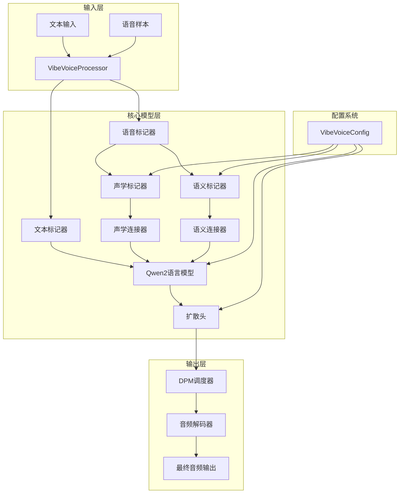
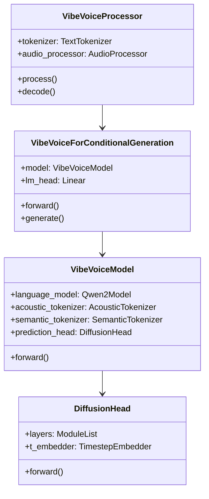
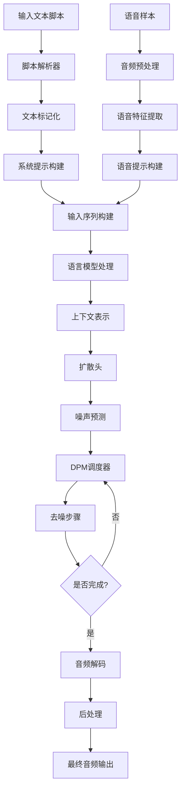

# VibeVoice 技术文档

## 目录
- [项目概述](#项目概述)
- [技术栈说明](#技术栈说明)
- [系统架构](#系统架构)
- [目录结构](#目录结构)
- [安装和运行指南](#安装和运行指南)
- [核心功能模块](#核心功能模块)
- [数据流程](#数据流程)
- [配置文件说明](#配置文件说明)
- [API接口文档](#api接口文档)
- [开发指南](#开发指南)
- [常见问题](#常见问题)

## 项目概述

### 🎙️ VibeVoice 简介

VibeVoice 是微软开发的前沿长对话文本转语音(TTS)模型，专门设计用于生成**表达丰富**、**长篇幅**、**多说话人**的对话音频，如播客等。

### 核心特性

- **超长音频生成**：支持生成长达90分钟的连续音频
- **多说话人支持**：最多支持4个不同说话人的对话
- **高质量音频**：采用7.5Hz超低帧率的连续语音标记器，保持音频保真度
- **自然对话流**：基于大语言模型理解文本上下文和对话流程
- **跨语言能力**：支持英文和中文，具备跨语言转换能力
- **自发性功能**：可自动生成背景音乐和音效

### 技术创新

1. **连续语音标记器**：使用声学和语义标记器，工作在7.5Hz超低帧率
2. **下一个标记扩散框架**：结合LLM理解文本和扩散头生成高保真音频细节
3. **模块化架构**：清晰分离的组件设计，便于维护和扩展

## 技术栈说明

### 核心技术栈

| 技术类别 | 技术选型 | 版本要求 | 用途说明 |
|---------|---------|---------|---------|
| **深度学习框架** | PyTorch | Latest | 模型训练和推理的核心框架 |
| **模型库** | Transformers | 4.51.3 | 预训练模型和标记器管理 |
| **加速库** | Accelerate | 1.6.0 | 分布式训练和推理加速 |
| **扩散模型** | Diffusers | Latest | 扩散模型实现和调度器 |
| **音频处理** | Librosa | Latest | 音频文件读取、处理和特征提取 |
| **数值计算** | NumPy, SciPy | Latest | 数值计算和科学计算 |
| **用户界面** | Gradio | Latest | Web界面和演示系统 |
| **配置管理** | ML-Collections | Latest | 模型配置和超参数管理 |

### 开发环境要求

- **Python版本**：≥ 3.9
- **CUDA支持**：推荐使用NVIDIA GPU
- **内存要求**：至少16GB RAM，推荐32GB+
- **存储空间**：模型文件需要10-50GB空间

### 推荐开发环境

```bash
# 推荐使用NVIDIA Deep Learning Container
sudo docker run --privileged --net=host --ipc=host \
  --ulimit memlock=-1:-1 --ulimit stack=-1:-1 \
  --gpus all --rm -it nvcr.io/nvidia/pytorch:24.07-py3
```

## 系统架构

### 整体架构图



### 组件关系图



## 目录结构

```
VibeVoice/
├── 📁 vibevoice/                    # 核心代码包
│   ├── 📁 modular/                  # 模块化组件
│   │   ├── configuration_vibevoice.py      # 配置类定义
│   │   ├── modeling_vibevoice.py           # 主模型实现
│   │   ├── modeling_vibevoice_inference.py # 推理优化版本
│   │   ├── modular_vibevoice_diffusion_head.py # 扩散头模块
│   │   ├── modular_vibevoice_tokenizer.py      # 语音标记器
│   │   ├── modular_vibevoice_text_tokenizer.py # 文本标记器
│   │   └── streamer.py                     # 流式音频处理
│   ├── 📁 processor/                # 数据处理器
│   │   ├── vibevoice_processor.py          # 主处理器
│   │   └── vibevoice_tokenizer_processor.py # 标记器处理器
│   ├── 📁 schedule/                 # 调度器
│   │   ├── dpm_solver.py                   # DPM求解器
│   │   └── timestep_sampler.py             # 时间步采样器
│   ├── 📁 configs/                  # 配置文件
│   │   ├── qwen2.5_1.5b_64k.json          # 1.5B模型配置
│   │   └── qwen2.5_7b_32k.json             # 7B模型配置
│   └── 📁 scripts/                  # 工具脚本
├── 📁 demo/                         # 演示和示例
│   ├── gradio_demo.py                      # Gradio Web界面
│   ├── inference_from_file.py              # 文件推理脚本
│   ├── VibeVoice_colab.ipynb              # Colab笔记本
│   ├── 📁 text_examples/                   # 示例文本
│   ├── 📁 voices/                          # 语音样本
│   └── 📁 example/                         # 输出示例
├── 📁 Figures/                      # 项目图片资源
├── pyproject.toml                   # 项目配置文件
├── README.md                        # 项目说明
└── LICENSE                          # 许可证文件
```

### 核心目录详解

#### `vibevoice/modular/` - 核心模块
- **配置系统**：定义模型的各种配置参数
- **模型实现**：包含主模型和推理优化版本
- **组件模块**：扩散头、标记器等独立组件
- **流式处理**：支持实时音频生成的流式组件

#### `vibevoice/processor/` - 数据处理
- **统一处理器**：整合文本和音频处理流程
- **标记器处理**：专门处理音频标记化

#### `vibevoice/schedule/` - 调度系统
- **扩散调度**：管理扩散模型的去噪过程
- **时间步管理**：控制生成过程的时间步

#### `demo/` - 演示系统
- **Web界面**：基于Gradio的用户友好界面
- **命令行工具**：支持批量处理的脚本
- **示例资源**：包含各种测试文本和语音样本

## 安装和运行指南

### 环境准备

#### 1. 系统要求检查
```bash
# 检查Python版本（需要≥3.9）
python --version

# 检查CUDA可用性（推荐）
nvidia-smi

# 检查可用内存（推荐≥16GB）
free -h
```

#### 2. 使用Docker环境（推荐）
```bash
# 拉取并运行NVIDIA PyTorch容器
sudo docker run --privileged --net=host --ipc=host \
  --ulimit memlock=-1:-1 --ulimit stack=-1:-1 \
  --gpus all --rm -it nvcr.io/nvidia/pytorch:24.07-py3

# 如果需要Flash Attention（可选）
pip install flash-attn --no-build-isolation
```

### 安装步骤

#### 1. 克隆项目
```bash
git clone https://github.com/microsoft/VibeVoice.git
cd VibeVoice/
```

#### 2. 安装依赖
```bash
# 使用pip安装（推荐开发模式）
pip install -e .

# 或者直接安装
pip install .
```

#### 3. 验证安装
```bash
# 测试导入
python -c "from vibevoice.modular import VibeVoiceForConditionalGeneration; print('安装成功！')"
```

### 快速开始

#### 1. 启动Web演示界面
```bash
# 安装音频处理依赖
apt update && apt install ffmpeg -y

# 启动1.5B模型演示
python demo/gradio_demo.py --model_path microsoft/VibeVoice-1.5B --share

# 启动Large模型演示（推荐，更稳定）
python demo/gradio_demo.py --model_path microsoft/VibeVoice-Large --share
```

#### 2. 命令行推理
```bash
# 单说话人示例
python demo/inference_from_file.py \
  --model_path microsoft/VibeVoice-Large \
  --txt_path demo/text_examples/1p_abs.txt \
  --speaker_names Alice

# 多说话人示例
python demo/inference_from_file.py \
  --model_path microsoft/VibeVoice-Large \
  --txt_path demo/text_examples/2p_music.txt \
  --speaker_names Alice Frank
```

#### 3. Python API使用
```python
from vibevoice.modular import VibeVoiceForConditionalGeneration
from vibevoice.processor import VibeVoiceProcessor

# 加载模型和处理器
model = VibeVoiceForConditionalGeneration.from_pretrained("microsoft/VibeVoice-Large")
processor = VibeVoiceProcessor.from_pretrained("microsoft/VibeVoice-Large")

# 准备输入文本
text = "Alice: Hello, how are you today? Bob: I'm doing great, thanks for asking!"

# 处理输入
inputs = processor(text, speaker_names=["Alice", "Bob"])

# 生成音频
with torch.no_grad():
    outputs = model.generate(**inputs, max_new_tokens=1000)
    
# 解码音频
audio = processor.decode(outputs.speech_outputs[0])
```

### 模型选择指南

| 模型版本 | 上下文长度 | 生成长度 | 内存需求 | 推荐用途 |
|---------|-----------|---------|---------|---------|
| VibeVoice-1.5B | 64K | ~90分钟 | 8-16GB | 开发测试、资源受限环境 |
| VibeVoice-Large | 32K | ~45分钟 | 16-32GB | 生产环境、高质量输出 |

### 性能优化建议

1. **GPU内存优化**
   ```python
   # 使用梯度检查点减少内存使用
   model.gradient_checkpointing_enable()
   
   # 使用混合精度
   model.half()  # 转换为FP16
   ```

2. **批处理优化**
   ```python
   # 批量处理多个文本
   texts = ["text1", "text2", "text3"]
   inputs = processor(texts, padding=True, return_tensors="pt")
   ```

3. **流式生成**
   ```python
   # 使用流式生成减少延迟
   from vibevoice.modular.streamer import AudioStreamer
   
   streamer = AudioStreamer()
   outputs = model.generate(**inputs, streamer=streamer)
   ```

## 核心功能模块

### 1. 语音标记器模块 (Speech Tokenizer)

#### 声学标记器 (Acoustic Tokenizer)
负责将原始音频转换为声学特征表示。

```python
class VibeVoiceAcousticTokenizerConfig:
    """声学标记器配置"""
    def __init__(self):
        self.channels = 1              # 音频通道数
        self.vae_dim = 64             # VAE维度
        self.encoder_ratios = [8,5,5,4,2,2]  # 编码器压缩比例
        self.causal = True            # 是否使用因果卷积
```

**主要功能**：
- 音频编码：将24kHz音频压缩到7.5Hz表示
- 特征提取：提取音频的声学特征
- 因果处理：支持流式音频处理

#### 语义标记器 (Semantic Tokenizer)
提取音频的语义信息，理解语音内容。

```python
class VibeVoiceSemanticTokenizerConfig:
    """语义标记器配置"""
    def __init__(self):
        self.vae_dim = 64             # 语义特征维度
        self.fix_std = 0              # 固定标准差
        self.std_dist_type = 'none'   # 标准差分布类型
```

**主要功能**：
- 语义理解：提取语音的语义表示
- 内容编码：将语音内容转换为向量表示
- 跨语言支持：支持多语言语义理解

### 2. 语言模型模块 (Language Model)

基于Qwen2架构的大语言模型，负责理解文本上下文和对话流程。

```python
class VibeVoiceModel:
    """主模型类"""
    def __init__(self, config):
        # 语言模型（基于Qwen2）
        self.language_model = AutoModel.from_config(config.decoder_config)

        # 语音组件
        self.acoustic_tokenizer = AutoModel.from_config(config.acoustic_tokenizer_config)
        self.semantic_tokenizer = AutoModel.from_config(config.semantic_tokenizer_config)

        # 连接器
        self.acoustic_connector = SpeechConnector(config.acoustic_vae_dim, lm_config.hidden_size)
        self.semantic_connector = SpeechConnector(config.semantic_vae_dim, lm_config.hidden_size)
```

**核心特性**：
- **上下文理解**：理解长对话的上下文关系
- **说话人建模**：区分和建模不同说话人
- **对话流控制**：管理对话的自然转换
- **多模态融合**：整合文本和语音信息

### 3. 扩散头模块 (Diffusion Head)

使用扩散模型生成高质量的音频细节。

```python
class VibeVoiceDiffusionHead:
    """扩散头模型"""
    def __init__(self, config):
        self.t_embedder = TimestepEmbedder(self.cond_dim)  # 时间步嵌入
        self.layers = nn.ModuleList([...])                 # 扩散层
        self.final_layer = FinalLayer(...)                # 最终输出层
```

**工作原理**：
1. **噪声预测**：预测每个时间步的噪声
2. **条件生成**：基于文本条件生成音频
3. **迭代去噪**：通过多步去噪生成最终音频

### 4. 处理器模块 (Processor)

统一的数据处理接口，整合文本和音频处理流程。

```python
class VibeVoiceProcessor:
    """统一处理器"""
    def __init__(self, tokenizer, audio_processor):
        self.tokenizer = tokenizer              # 文本标记器
        self.audio_processor = audio_processor  # 音频处理器
        self.system_prompt = "..."             # 系统提示词

    def __call__(self, text, voice_samples=None, speaker_names=None):
        """处理输入文本和语音样本"""
        # 解析脚本
        parsed_lines = self._parse_script(text)

        # 创建语音提示
        if voice_samples:
            voice_tokens = self._create_voice_prompt(voice_samples)

        # 构建输入序列
        return self._build_input_sequence(parsed_lines, voice_tokens)
```

**主要功能**：
- **文本解析**：解析对话脚本，识别说话人
- **语音处理**：处理语音样本，提取特征
- **格式转换**：将输入转换为模型所需格式
- **批处理支持**：支持批量处理多个输入

### 5. 调度器模块 (Scheduler)

管理扩散模型的生成过程。

```python
class DPMSolverMultistepScheduler:
    """DPM多步调度器"""
    def __init__(self, num_train_timesteps=1000, beta_schedule="cosine"):
        self.num_train_timesteps = num_train_timesteps
        self.beta_schedule = beta_schedule

    def step(self, model_output, timestep, sample):
        """执行一步去噪"""
        return self._dpm_solver_step(model_output, timestep, sample)
```

**调度策略**：
- **时间步管理**：控制扩散过程的时间步
- **噪声调度**：管理噪声的添加和去除
- **采样优化**：优化采样过程提高质量

## 数据流程

### 完整数据流程图



### 详细处理步骤

#### 1. 输入预处理阶段
```python
def preprocess_input(text, voice_samples, speaker_names):
    """输入预处理"""
    # 步骤1：解析对话脚本
    parsed_script = parse_dialogue_script(text)

    # 步骤2：提取说话人信息
    speakers = extract_speakers(parsed_script)

    # 步骤3：处理语音样本
    if voice_samples:
        voice_features = process_voice_samples(voice_samples)

    # 步骤4：构建输入格式
    return build_model_input(parsed_script, voice_features, speakers)
```

#### 2. 模型推理阶段
```python
def model_inference(inputs):
    """模型推理过程"""
    # 步骤1：文本编码
    text_embeddings = language_model.encode(inputs['text_tokens'])

    # 步骤2：语音特征融合
    if 'voice_features' in inputs:
        speech_embeddings = speech_tokenizer.encode(inputs['voice_features'])
        combined_embeddings = fuse_embeddings(text_embeddings, speech_embeddings)

    # 步骤3：上下文建模
    context_representation = language_model.forward(combined_embeddings)

    # 步骤4：扩散生成
    audio_latents = diffusion_head.generate(context_representation)

    return audio_latents
```

#### 3. 音频生成阶段
```python
def generate_audio(audio_latents):
    """音频生成过程"""
    # 步骤1：初始化噪声
    noise = torch.randn_like(audio_latents)

    # 步骤2：迭代去噪
    for timestep in scheduler.timesteps:
        # 预测噪声
        noise_pred = diffusion_head(noise, timestep, audio_latents)

        # 更新样本
        noise = scheduler.step(noise_pred, timestep, noise).prev_sample

    # 步骤3：解码音频
    audio_waveform = audio_decoder.decode(noise)

    return audio_waveform
```

### 数据格式说明

#### 输入格式
```python
# 文本输入格式
text_input = """
Alice: Hello, how are you doing today?
Bob: I'm doing great, thanks for asking! How about you?
Alice: I'm wonderful, thank you.
"""

# 语音样本格式
voice_samples = [
    "path/to/alice_voice.wav",    # Alice的语音样本
    "path/to/bob_voice.wav"       # Bob的语音样本
]

# 说话人名称
speaker_names = ["Alice", "Bob"]
```

#### 中间表示格式
```python
# 标记化后的格式
tokenized_input = {
    'input_ids': torch.tensor([...]),           # 文本标记ID
    'attention_mask': torch.tensor([...]),      # 注意力掩码
    'speech_inputs': torch.tensor([...]),       # 语音输入特征
    'speech_attention_mask': torch.tensor([...]), # 语音注意力掩码
    'speaker_ids': torch.tensor([...])          # 说话人ID
}
```

#### 输出格式
```python
# 生成输出格式
generation_output = {
    'sequences': torch.tensor([...]),           # 生成的标记序列
    'speech_outputs': [torch.tensor([...])],    # 生成的音频波形
    'generation_config': {...}                  # 生成配置信息
}
```

## 配置文件说明

### 主配置文件结构

VibeVoice使用分层配置系统，主要配置类包括：

#### 1. 主配置类 (VibeVoiceConfig)
```python
class VibeVoiceConfig(PretrainedConfig):
    """主配置类，整合所有子配置"""
    model_type = "vibevoice"
    is_composition = True

    sub_configs = {
        "acoustic_tokenizer_config": VibeVoiceAcousticTokenizerConfig,
        "semantic_tokenizer_config": VibeVoiceSemanticTokenizerConfig,
        "decoder_config": Qwen2Config,
        "diffusion_head_config": VibeVoiceDiffusionHeadConfig,
    }
```

#### 2. 声学标记器配置
```json
{
  "acoustic_tokenizer_config": {
    "channels": 1,
    "vae_dim": 64,
    "encoder_ratios": [8, 5, 5, 4, 2, 2],
    "encoder_depths": "3-3-3-3-3-3-8",
    "decoder_ratios": [2, 2, 4, 5, 5, 8],
    "causal": true,
    "corpus_normalize": 0.0
  }
}
```

**参数说明**：
- `channels`: 音频通道数（通常为1，单声道）
- `vae_dim`: VAE潜在空间维度
- `encoder_ratios`: 编码器各层的下采样比例
- `encoder_depths`: 各层的深度配置
- `causal`: 是否使用因果卷积（支持流式处理）

#### 3. 扩散头配置
```json
{
  "diffusion_head_config": {
    "hidden_size": 768,
    "head_layers": 4,
    "head_ffn_ratio": 3.0,
    "latent_size": 64,
    "prediction_type": "v_prediction",
    "diffusion_type": "ddpm",
    "ddpm_num_steps": 1000,
    "ddpm_num_inference_steps": 20,
    "ddpm_beta_schedule": "cosine"
  }
}
```

**关键参数**：
- `head_layers`: 扩散头的层数
- `ddpm_num_steps`: 训练时的扩散步数
- `ddpm_num_inference_steps`: 推理时的去噪步数
- `prediction_type`: 预测类型（v_prediction/epsilon）

### 预设配置文件

#### 1.5B模型配置
```json
{
  "decoder_config": {
    "hidden_size": 1536,
    "intermediate_size": 8960,
    "num_attention_heads": 12,
    "num_hidden_layers": 28,
    "max_position_embeddings": 65536,
    "vocab_size": 151936
  }
}
```

#### Large模型配置
```json
{
  "decoder_config": {
    "hidden_size": 4096,
    "intermediate_size": 22016,
    "num_attention_heads": 32,
    "num_hidden_layers": 32,
    "max_position_embeddings": 32768,
    "vocab_size": 151936
  }
}
```

### 自定义配置示例

```python
from vibevoice.modular.configuration_vibevoice import VibeVoiceConfig

# 加载基础配置
config = VibeVoiceConfig.from_pretrained("microsoft/VibeVoice-Large")

# 修改扩散参数
config.diffusion_head_config.ddpm_num_inference_steps = 10  # 减少推理步数
config.diffusion_head_config.head_layers = 6               # 增加层数

# 修改音频参数
config.acoustic_tokenizer_config.vae_dim = 128             # 增加VAE维度

# 保存自定义配置
config.save_pretrained("./custom_config")
```

## API接口文档

### 核心API类

#### 1. VibeVoiceForConditionalGeneration

主要的模型类，提供文本到语音的生成功能。

```python
class VibeVoiceForConditionalGeneration:
    """VibeVoice条件生成模型"""

    @classmethod
    def from_pretrained(cls, model_name_or_path, **kwargs):
        """从预训练模型加载"""
        pass

    def generate(self, input_ids, attention_mask=None, **kwargs):
        """生成音频"""
        pass

    def forward(self, input_ids, labels=None, **kwargs):
        """前向传播（训练用）"""
        pass
```

**主要方法**：

##### `from_pretrained(model_name_or_path, **kwargs)`
加载预训练模型。

**参数**：
- `model_name_or_path` (str): 模型名称或路径
- `torch_dtype` (torch.dtype): 模型数据类型
- `device_map` (str): 设备映射策略

**示例**：
```python
model = VibeVoiceForConditionalGeneration.from_pretrained(
    "microsoft/VibeVoice-Large",
    torch_dtype=torch.float16,
    device_map="auto"
)
```

##### `generate(**inputs, **generation_config)`
生成音频输出。

**参数**：
- `input_ids` (torch.Tensor): 输入标记ID
- `attention_mask` (torch.Tensor): 注意力掩码
- `max_new_tokens` (int): 最大生成标记数
- `do_sample` (bool): 是否使用采样
- `temperature` (float): 采样温度
- `top_p` (float): 核采样参数

**返回**：
- `VibeVoiceGenerationOutput`: 包含生成序列和音频输出

**示例**：
```python
outputs = model.generate(
    input_ids=inputs['input_ids'],
    attention_mask=inputs['attention_mask'],
    max_new_tokens=1000,
    do_sample=True,
    temperature=0.7,
    top_p=0.9
)
```

#### 2. VibeVoiceProcessor

数据处理器，负责输入预处理和输出后处理。

```python
class VibeVoiceProcessor:
    """VibeVoice处理器"""

    def __init__(self, tokenizer, audio_processor, **kwargs):
        """初始化处理器"""
        pass

    def __call__(self, text, voice_samples=None, **kwargs):
        """处理输入"""
        pass

    def decode(self, speech_outputs, **kwargs):
        """解码音频输出"""
        pass
```

**主要方法**：

##### `__call__(text, voice_samples=None, speaker_names=None, **kwargs)`
处理输入文本和语音样本。

**参数**：
- `text` (str or List[str]): 输入文本或文本列表
- `voice_samples` (List[str or np.ndarray]): 语音样本路径或数组
- `speaker_names` (List[str]): 说话人名称列表
- `return_tensors` (str): 返回张量类型

**返回**：
- `Dict[str, torch.Tensor]`: 处理后的输入字典

**示例**：
```python
inputs = processor(
    text="Alice: Hello! Bob: Hi there!",
    voice_samples=["alice.wav", "bob.wav"],
    speaker_names=["Alice", "Bob"],
    return_tensors="pt"
)
```

##### `decode(speech_outputs, sampling_rate=24000, **kwargs)`
解码音频输出为波形。

**参数**：
- `speech_outputs` (torch.Tensor): 模型输出的音频特征
- `sampling_rate` (int): 采样率
- `normalize` (bool): 是否归一化

**返回**：
- `np.ndarray`: 音频波形数组

**示例**：
```python
audio_waveform = processor.decode(
    outputs.speech_outputs[0],
    sampling_rate=24000,
    normalize=True
)
```

### 流式API

#### AudioStreamer

支持实时音频流式生成。

```python
from vibevoice.modular.streamer import AudioStreamer

# 创建流式器
streamer = AudioStreamer(
    sampling_rate=24000,
    chunk_size=1024
)

# 流式生成
outputs = model.generate(
    **inputs,
    streamer=streamer,
    max_new_tokens=1000
)

# 获取流式音频块
for audio_chunk in streamer:
    # 处理音频块
    play_audio(audio_chunk)
```

### 批处理API

```python
# 批量处理多个文本
texts = [
    "Alice: Hello! Bob: Hi!",
    "Charlie: Good morning! Diana: Good morning!"
]

# 批量处理
batch_inputs = processor(
    texts,
    padding=True,
    return_tensors="pt"
)

# 批量生成
batch_outputs = model.generate(
    **batch_inputs,
    max_new_tokens=1000
)

# 解码所有输出
audio_list = []
for speech_output in batch_outputs.speech_outputs:
    audio = processor.decode(speech_output)
    audio_list.append(audio)
```

## 开发指南

### 开发环境设置

#### 1. 开发依赖安装
```bash
# 克隆项目
git clone https://github.com/microsoft/VibeVoice.git
cd VibeVoice

# 安装开发依赖
pip install -e ".[dev]"

# 安装预提交钩子
pre-commit install
```

#### 2. 代码风格配置
项目使用以下代码风格工具：
- **Black**: 代码格式化
- **isort**: 导入排序
- **flake8**: 代码检查
- **mypy**: 类型检查

```bash
# 格式化代码
black vibevoice/
isort vibevoice/

# 检查代码
flake8 vibevoice/
mypy vibevoice/
```

### 最佳实践

#### 1. 模型使用最佳实践

**内存优化**：
```python
# 使用半精度减少内存使用
model = model.half()

# 启用梯度检查点
model.gradient_checkpointing_enable()

# 使用CPU卸载
model = model.to("cpu")
```

**性能优化**：
```python
# 编译模型（PyTorch 2.0+）
model = torch.compile(model)

# 使用Flash Attention
model.config.use_flash_attention_2 = True

# 批量推理
batch_size = 4
for i in range(0, len(texts), batch_size):
    batch_texts = texts[i:i+batch_size]
    # 处理批次
```

#### 2. 音频处理最佳实践

**音频预处理**：
```python
import librosa
import soundfile as sf

def preprocess_audio(audio_path, target_sr=24000):
    """音频预处理"""
    # 加载音频
    audio, sr = librosa.load(audio_path, sr=target_sr)

    # 归一化
    audio = librosa.util.normalize(audio)

    # 去除静音
    audio, _ = librosa.effects.trim(audio, top_db=20)

    return audio
```

**音频后处理**：
```python
def postprocess_audio(audio, sr=24000):
    """音频后处理"""
    # 归一化到[-1, 1]
    audio = audio / np.max(np.abs(audio))

    # 应用淡入淡出
    fade_samples = int(0.1 * sr)  # 0.1秒淡入淡出
    audio[:fade_samples] *= np.linspace(0, 1, fade_samples)
    audio[-fade_samples:] *= np.linspace(1, 0, fade_samples)

    return audio
```

#### 3. 错误处理最佳实践

```python
import logging
from transformers.utils import logging as transformers_logging

# 设置日志级别
transformers_logging.set_verbosity_info()
logger = logging.getLogger(__name__)

def safe_generate(model, processor, text, **kwargs):
    """安全的生成函数"""
    try:
        # 输入验证
        if not text or not isinstance(text, str):
            raise ValueError("输入文本不能为空且必须是字符串")

        # 处理输入
        inputs = processor(text, return_tensors="pt")

        # 生成音频
        with torch.no_grad():
            outputs = model.generate(**inputs, **kwargs)

        # 解码音频
        audio = processor.decode(outputs.speech_outputs[0])

        return audio

    except Exception as e:
        logger.error(f"生成音频时发生错误: {e}")
        return None
```

## 常见问题和故障排除

### 常见问题 (FAQ)

#### Q1: 这是一个预训练模型吗？
**A:** 是的，这是一个预训练模型，没有经过任何后训练或基准特定优化。这使得VibeVoice非常通用且有趣。

#### Q2: 随机触发声音/音乐/背景音乐
**A:** 正如演示页面所示，背景音乐或声音是自发的。这意味着我们无法直接控制是否生成它们。模型是内容感知的，这些声音基于输入文本和选择的语音提示触发。

**注意事项**：
- 如果语音提示包含背景音乐，生成的语音也更可能有背景音乐
- 如果语音提示是干净的（无BGM），但输入文本包含介绍性词语如"欢迎"、"你好"或"然而"，背景音乐仍可能出现
- Large模型更稳定，生成意外背景音乐的概率更低

#### Q3: 文本规范化？
**A:** 我们在训练或推理期间不执行任何文本规范化。我们的理念是大语言模型应该能够自己处理复杂的用户输入。但是，由于训练数据的性质，您可能仍会遇到一些边缘情况。

#### Q4: 唱歌能力
**A:** 我们的训练数据**不包含任何音乐数据**。唱歌能力是模型的涌现能力（这就是为什么即使在著名歌曲如'See You Again'上也可能听起来跑调）。Large模型比1.5B模型更可能表现出这种能力。

#### Q5: 一些中文发音错误
**A:** 我们训练集中的中文数据量明显少于英文数据。此外，某些特殊字符（如中文引号）可能偶尔导致发音问题。

#### Q6: 跨语言转换的不稳定性
**A:** 模型确实表现出强大的跨语言转换能力，包括保持口音，但其性能可能不稳定。这是模型的涌现能力，我们没有专门优化。通过重复采样可能可以获得满意的结果。

### 故障排除指南

#### 1. 安装问题

**问题**: `ImportError: No module named 'vibevoice'`
```bash
# 解决方案：重新安装包
pip uninstall vibevoice
pip install -e .
```

**问题**: CUDA内存不足
```python
# 解决方案：使用更小的模型或优化内存使用
model = VibeVoiceForConditionalGeneration.from_pretrained(
    "microsoft/VibeVoice-1.5B",  # 使用更小的模型
    torch_dtype=torch.float16,   # 使用半精度
    device_map="auto"            # 自动设备映射
)
```

**问题**: Flash Attention安装失败
```bash
# 解决方案：手动安装Flash Attention
pip install flash-attn --no-build-isolation
# 或者跳过Flash Attention
export USE_FLASH_ATTENTION=0
```

#### 2. 运行时问题

**问题**: 生成的音频质量差
```python
# 解决方案：调整生成参数
outputs = model.generate(
    **inputs,
    max_new_tokens=2000,        # 增加生成长度
    do_sample=True,             # 启用采样
    temperature=0.7,            # 调整温度
    top_p=0.9,                  # 使用核采样
    num_inference_steps=20      # 增加推理步数
)
```

**问题**: 中文语音不稳定
```python
# 解决方案：使用推荐设置
# 1. 使用英文标点符号
text = "张三: 你好，今天天气很好。李四: 是的，很适合出去走走。"

# 2. 使用Large模型
model = VibeVoiceForConditionalGeneration.from_pretrained("microsoft/VibeVoice-Large")

# 3. 分块处理长文本
def chunk_text(text, max_length=100):
    sentences = text.split('。')
    chunks = []
    current_chunk = ""

    for sentence in sentences:
        if len(current_chunk + sentence) < max_length:
            current_chunk += sentence + "。"
        else:
            chunks.append(current_chunk)
            current_chunk = sentence + "。"

    if current_chunk:
        chunks.append(current_chunk)

    return chunks
```

**问题**: 音频播放问题
```python
# 解决方案：正确保存和播放音频
import soundfile as sf
from IPython.display import Audio

# 保存音频
sf.write("output.wav", audio, samplerate=24000)

# 在Jupyter中播放
Audio(audio, rate=24000)

# 使用pygame播放
import pygame
pygame.mixer.init(frequency=24000)
pygame.mixer.music.load("output.wav")
pygame.mixer.music.play()
```

#### 3. 性能优化问题

**问题**: 生成速度慢
```python
# 解决方案：性能优化
# 1. 使用编译模型（PyTorch 2.0+）
model = torch.compile(model, mode="reduce-overhead")

# 2. 减少推理步数
generation_config = {
    "num_inference_steps": 10,  # 减少到10步
    "max_new_tokens": 1000
}

# 3. 使用批处理
batch_inputs = processor(texts, padding=True, return_tensors="pt")
batch_outputs = model.generate(**batch_inputs, **generation_config)
```

**问题**: 内存泄漏
```python
# 解决方案：正确的内存管理
import gc
import torch

def generate_with_cleanup(model, inputs):
    try:
        with torch.no_grad():
            outputs = model.generate(**inputs)
        return outputs
    finally:
        # 清理GPU内存
        if torch.cuda.is_available():
            torch.cuda.empty_cache()
        # 强制垃圾回收
        gc.collect()
```

### 调试技巧

#### 1. 启用详细日志
```python
import logging
from transformers.utils import logging as transformers_logging

# 设置详细日志
transformers_logging.set_verbosity_debug()
logging.basicConfig(level=logging.DEBUG)
```

#### 2. 检查模型状态
```python
# 检查模型设备
print(f"模型设备: {next(model.parameters()).device}")

# 检查模型数据类型
print(f"模型数据类型: {next(model.parameters()).dtype}")

# 检查模型大小
total_params = sum(p.numel() for p in model.parameters())
print(f"模型参数总数: {total_params:,}")
```

#### 3. 验证输入格式
```python
def validate_inputs(inputs):
    """验证输入格式"""
    required_keys = ['input_ids', 'attention_mask']

    for key in required_keys:
        if key not in inputs:
            raise ValueError(f"缺少必需的输入键: {key}")

    # 检查张量形状
    print(f"input_ids形状: {inputs['input_ids'].shape}")
    print(f"attention_mask形状: {inputs['attention_mask'].shape}")

    # 检查设备
    print(f"输入设备: {inputs['input_ids'].device}")
```

### 学习资源

#### 官方资源
- [项目主页](https://microsoft.github.io/VibeVoice)
- [技术报告](https://arxiv.org/pdf/2508.19205)
- [Hugging Face模型集合](https://huggingface.co/collections/microsoft/vibevoice-68a2ef24a875c44be47b034f)
- [在线演示](https://aka.ms/VibeVoice-Demo)

#### 相关技术学习
- [Transformers库文档](https://huggingface.co/docs/transformers)
- [扩散模型教程](https://huggingface.co/docs/diffusers)
- [PyTorch官方教程](https://pytorch.org/tutorials/)
- [语音处理基础](https://librosa.org/doc/latest/tutorial.html)

#### 社区资源
- [GitHub讨论区](https://github.com/microsoft/VibeVoice/discussions)
- [Hugging Face社区](https://huggingface.co/microsoft/VibeVoice-Large/discussions)

---

## 总结

VibeVoice是一个强大的长对话文本转语音系统，具有以下优势：

1. **技术先进性**：采用最新的扩散模型和语音标记器技术
2. **功能丰富**：支持多说话人、长音频、跨语言等功能
3. **易于使用**：提供简洁的API和丰富的示例
4. **高度可定制**：模块化设计，支持灵活配置
5. **活跃社区**：微软官方支持，社区活跃

通过本文档，开发者可以快速上手VibeVoice，并根据具体需求进行定制开发。如有问题，请参考故障排除部分或在社区寻求帮助。
